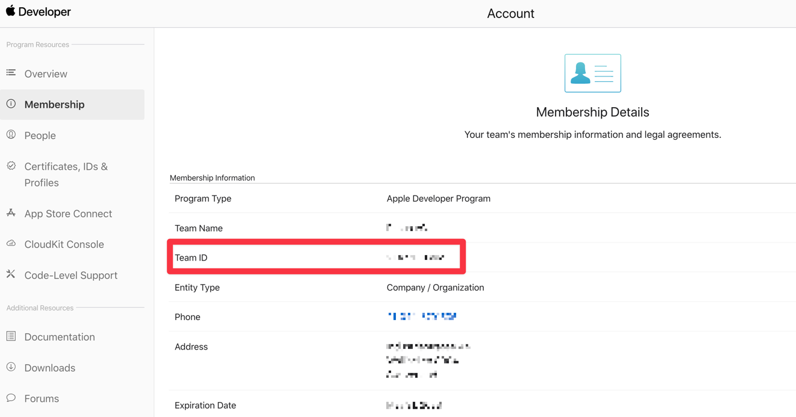
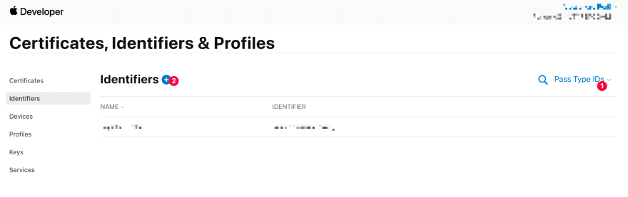
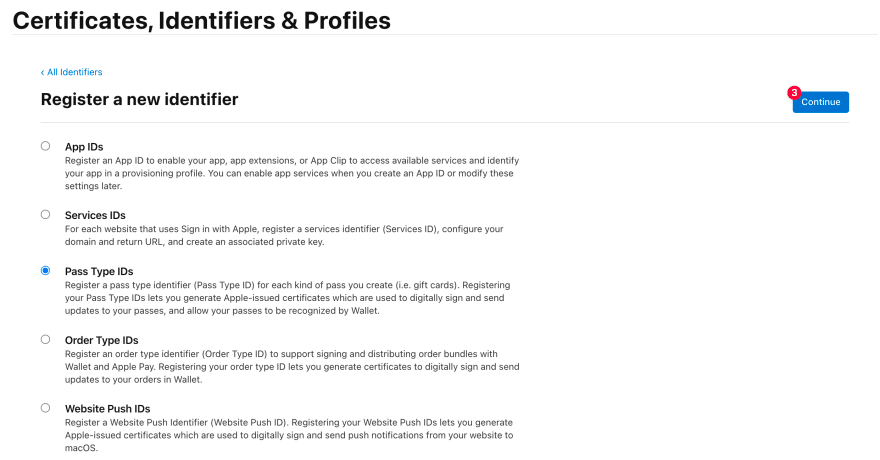
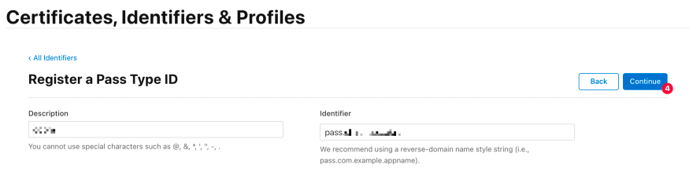
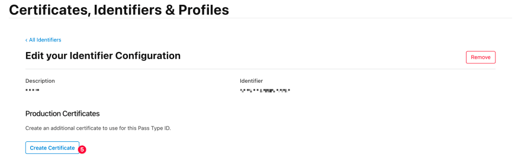
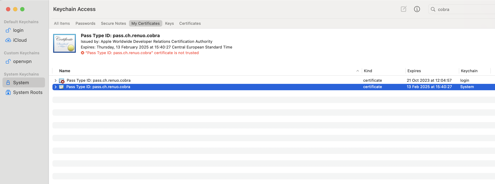

# Setup Passkit Environment variables

### `PASSKIT_WEB_SERVICE_HOST`

This is the host where your Rails app is running. It is used to generate the URLs for the passes. 
When the device wants to update the Pass, it will invoke services on this host.
In production, it will simply be your domain name, but in development you can use [ngrok](https://ngrok.com/) to expose your local server to the internet.

**Remember that it must always start with `https://`.**

### `PASSKIT_APPLE_INTERMEDIATE_CERTIFICATE`

This is the easy one.
Head to https://www.apple.com/certificateauthority/ and download the latest Apple Intermediate Certificate Worldwide Developer Relations.
You might want to choose the one with the longest expiration date.

### `PASSKIT_APPLE_TEAM_IDENTIFIER`

You find this in your Apple Developer dashboard, under Membership.

### `PASSKIT_PASS_TYPE_IDENTIFIER`, `PASSKIT_PRIVATE_P12_CERTIFICATE` and `PASSKIT_CERTIFICATE_KEY`

Head to your Apple Developers console and generate a new certificate.

The identifier is the `PASSKIT_PASS_TYPE_IDENTIFIER` variable.

Now, create a certificate signing request: https://help.apple.com/developer-account/#/devbfa00fef7

And create the certificate:

At the end, you'll have a `pass.cer` file.

Open it in the Keychain Access tool and export it (you must be in the My Certificates tab):

Set a password and get your p12 file. The path to this file is the `PASSKIT_PRIVATE_P12_CERTIFICATE` variable.
Save the password. This is the `PASSKIT_CERTIFICATE_KEY` variable.

`PKCS12_parse: unsupported`: you might encounter this issue: https://help.heroku.com/88GYDTB2/how-do-i-configure-openssl-to-allow-the-use-of-legacy-cryptographic-algorithms
